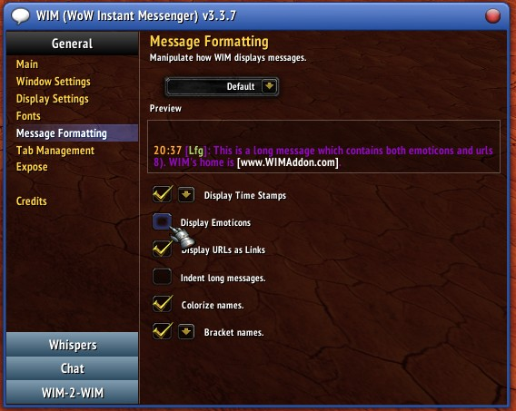

# TwitchEmotes-335

This is a port of [Twitch Emotes v2](https://www.curseforge.com/wow/addons/twitch-emotes-v2) to WotLK (3.3.5a) legacy client.

* WotLK (3.3.5a) port: [sogladev](https://github.com/sogladev/)
* Original addon: [Twitch Emotes v2](https://www.curseforge.com/wow/addons/twitch-emotes-v2) by [ren9790](https://addons.wago.io/user/ren9790)

## Description

Shows Twitch emotes in your chat by typing them as you would into Twitch. Simply type `peepoHappy` and peepoHappy will appear in your chat.

This port adapts the popular retail addon for WotLK 3.3.5a legacy servers, maintaining full functionality while being compatible with the older client.

## Requirements
This addon requires the ClassicAPI addon from: https://gitlab.com/Tsoukie/classicapi

## Port-Specific Features

**What works in 3.3.5a:**
- [x] All emote functionality from the original addon
- [x] Minimap integration with dropdown preview
- [x] Statistics page (Shift-click minimap)
- [x] Favorite List setting
- [x] Hover tooltips and Shift-click to repost emotes
- [x] Animated emotes
- [x] WIM 3.3.7 support (if WIM's Emote feature is disabled: `/wim -> General: Message Formatting -> uncheck "Display Emoticons"`)
- [x] Auto-completion with Tab/Shift-Tab navigation
- [ ] Auto-completion with Arrow key navigation
- [x] Auto-completion accept with ':'
- [ ] Auto-completion accept and send (quick-send) with Enter (disabled by default, see [#2](https://github.com/sogladev/TwitchEmotes-335/issues/2))

**Known Issues & Adaptations:**
See [GitHub Issues](https://github.com/sogladev/TwitchEmotes-335/issues) for details.

- [Multiple emotes sizing/glitches](https://github.com/sogladev/TwitchEmotes-335/issues/1):
  Using several emotes produced overlap/glitches.
  *Solved by dynamically scaling emotes down when more than one is used.*

- [Autocomplete "Enter" and "Arrow keys" don't work](https://github.com/sogladev/TwitchEmotes-335/issues/2):
  Arrow keys and Enter key do not work due to client API limitations.
  *Workaround: Using Enter to quick-send can be enabled, but may cause a taint error.*

*For detailed technical changes made to ensure 3.3.5a compatibility, see the [changes](https://github.com/sogladev/TwitchEmotes-335/compare/c13a892e4083...main) documented in the git history.*

## Usage

Type emote names in chat as you would on Twitch (e.g., `OMEGALUL`, `Pepega`, `forsenE`).

**Auto-completion:** Type a colon `:` prefix to open a dropdown with all available emotes. Use Tab/Shift-Tab to navigate, hit colon again to select, or Enter to quick send.

**Minimap Integration:** Click the minimap button to preview a subset of emote icons. The minimap dropdown only shows emotes from enabled categories, which can be managed in the addon settings using the Favorite List checkboxes. Shift-click the minimap button to open the statistics page.

**Interactive Emotes:** Hover over emotes to see their names, or Shift-click to repost them in chat.

## WIM (WoW Instant Messenger) Support

TwitchEmotes-335 includes full support for WIM 3.3.7. However, **WIM's built-in emoticon system must be disabled** for TwitchEmotes to work properly.

**To enable TwitchEmotes support in WIM:**

1. Open WIM settings: `/wim`
2. Navigate to **General** → **Message Formatting**
3. **Uncheck "Display Emoticons"**

*With WIM's emoticons disabled, TwitchEmotes will handle all emote processing in whisper windows, including full animation support.*

## Credits

- **Original addon:** [Twitch Emotes v2](https://www.curseforge.com/wow/addons/twitch-emotes-v2) by [ren9790](https://addons.wago.io/user/ren9790)
   Used version: Aug 13, 2025 Twitch Emotes V2.62.4 - 11.2 update
- **3.3.5a Port:** [sogladev](https://github.com/sogladev/)
- **Emote Sources:** Twitch streamers, BTTV, FFZ, Discord, and community contributions

*This addon does not access the Twitch API - emotes are added manually by the author.*

## Version History

See `Ren - Changelog.txt` for detailed version history and emote additions.
